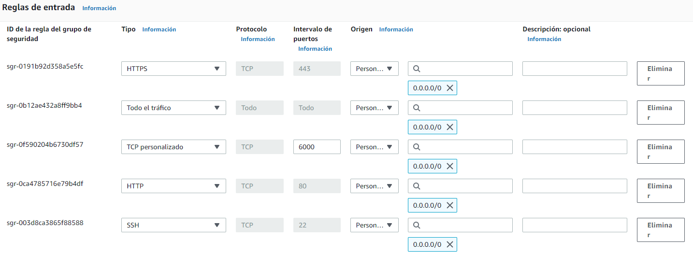
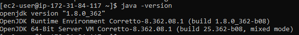
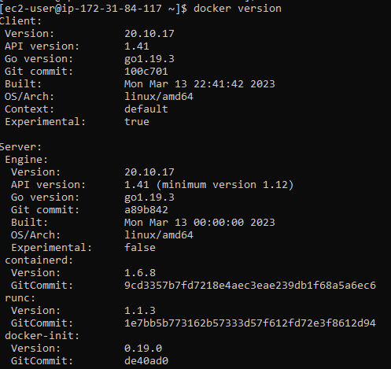
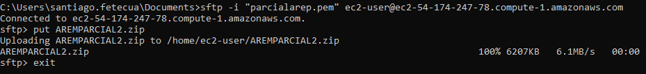
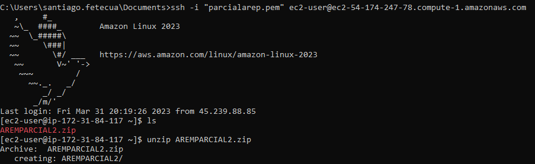
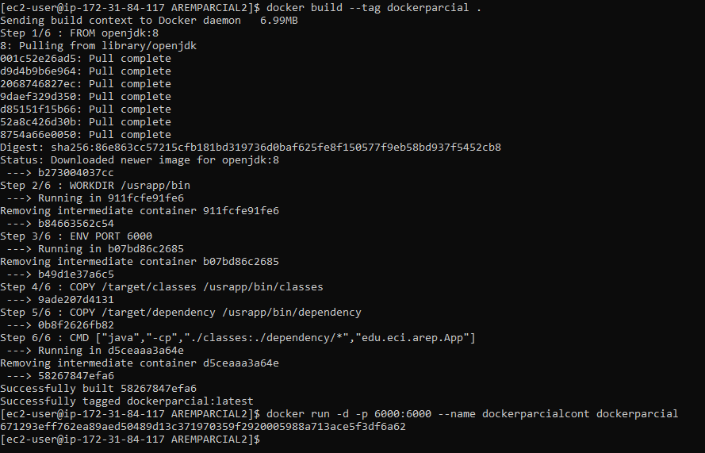
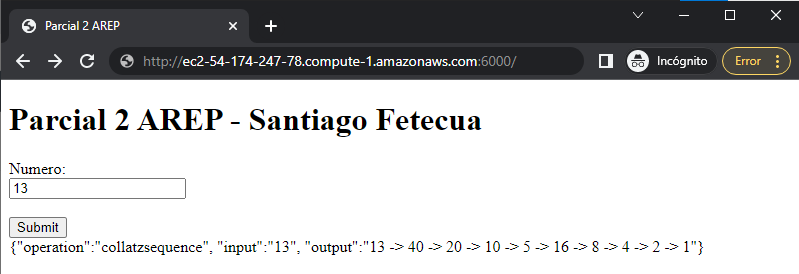

# AREP PARCIAL2 - Santiago Fetecua

## Procedimiento
* Se hizo la creacion de la instancia EC2 en AWS, posteriormente se configuro el grupo de seguridad.



* Se instaló Java y Docker en la maquina 




* Por medio de SFTP se subió el proyecto previamente compilado a la maquina EC2



* Por medio de SSH se conecto a la maquina EC2 y se ejecuto el comando para crear la imagen de docker y el contenedor



* Se hizo la prueba de la aplicacion en el navegador



### Video

[Video](https://share.icloud.com/photos/03dEqcMuBuobPETT4nhskXvAg)

### Estructura del proyecto

```
.
│
├───src
│   ├───main
│   │   ├───java
│   │   │   └───edu
│   │   │       └───eci
│   │   │           └───arep
│   │   │                   App.java
│   │   │
│   │   └───resources
│   │       └───public
│   │               index.html
│   │
│   └───test
│       └───java
│           └───edu
│               └───eci
│                   └───arep
│                           AppTest.java

```

## Construido con

* [Maven](https://maven.apache.org/) - Dependency Management
* [JAVA](https://www.java.com/es/download/) - Lenguaje de programación
* [GIT](https://git-scm.com/) - Control de versiones
* [Docker](https://www.docker.com/) - Contenedores

## Autor

* **Santiago Fetecua** - [santiago-f20](https://github.com/santiago-f20)